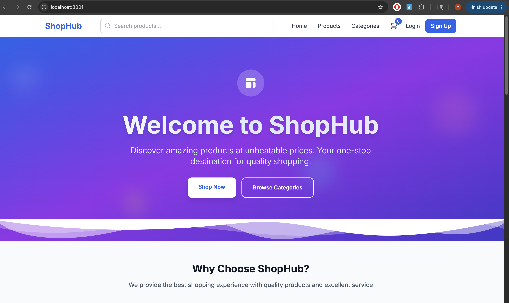
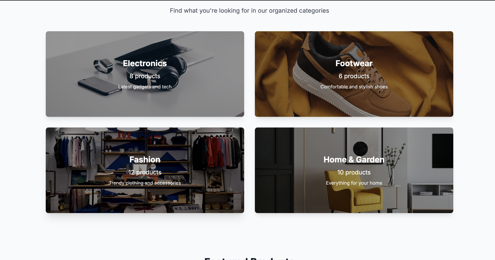
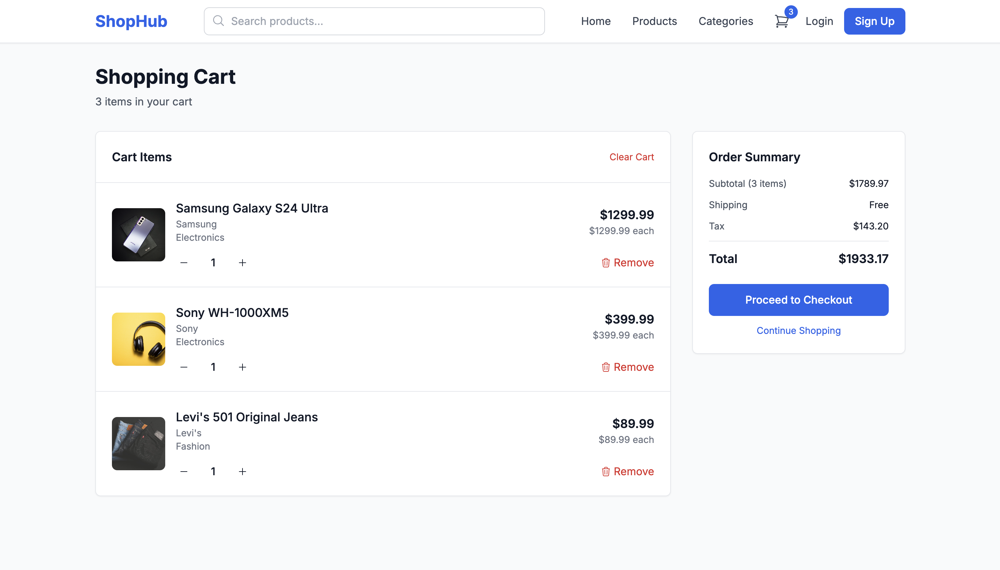

# 🛍️ ShopHub - E-Commerce Microservices Platform

A modern, full-stack e-commerce platform built with Spring Boot microservices architecture and React frontend. This project demonstrates a complete e-commerce solution with user management, product catalog, shopping cart, order processing, and payment integration.



## ✨ Features

### 🎯 Core Features
- **User Authentication & Authorization** - JWT-based authentication with role-based access control
- **Product Catalog** - Comprehensive product management with categories, search, and filtering
- **Shopping Cart** - Real-time cart management with quantity controls
- **Order Management** - Complete order lifecycle from creation to fulfillment
- **Payment Processing** - Secure payment integration (simulated)
- **Responsive Design** - Modern, mobile-friendly UI built with Tailwind CSS

### 🏗️ Architecture Features
- **Microservices Architecture** - Scalable, maintainable service-oriented design
- **Service Discovery** - Netflix Eureka for dynamic service registration
- **API Gateway** - Centralized routing and load balancing
- **Configuration Management** - Centralized configuration with Spring Cloud Config
- **Load Balancing** - Client-side load balancing for high availability

### 🛠️ Technical Features
- **Frontend**: React 18 + TypeScript + Tailwind CSS
- **Backend**: Spring Boot 2.5.4 + Spring Cloud
- **Database**: H2 (Development) / PostgreSQL (Production ready)
- **Authentication**: JWT tokens with Spring Security
- **API Documentation**: RESTful APIs with proper documentation
- **Real-time Updates**: Live cart updates and notifications

## 🏛️ Architecture Overview

```
┌─────────────────┐    ┌─────────────────┐    ┌─────────────────┐
│   React Frontend│    │   API Gateway   │    │  Discovery      │
│   (Port 3000)   │◄──►│   (Port 8080)   │◄──►│  Service        │
└─────────────────┘    └─────────────────┘    │  (Port 8762)    │
                                              └─────────────────┘
                                                       │
                                                       ▼
┌─────────────────┐    ┌─────────────────┐    ┌─────────────────┐
│  Config Server  │    │  User Service   │    │ Product Service │
│  (Port 8888)    │    │  (Port 8081)    │    │  (Port 8082)    │
└─────────────────┘    └─────────────────┘    └─────────────────┘
                                                       │
                                                       ▼
┌─────────────────┐    ┌─────────────────┐    ┌─────────────────┐
│ Payment Service │    │  Order Service  │    │   H2 Database  │
│  (Port 8084)    │    │  (Port 8083)    │    │   (In-Memory)  │
└─────────────────┘    └─────────────────┘    └─────────────────┘
```

## 🚀 Quick Start

### Prerequisites
- **Java 11+** (OpenJDK or Oracle JDK)
- **Node.js 18+** and npm
- **Maven 3.6+**
- **Git**

### 1. Clone the Repository
```bash
git clone https://github.com/yourusername/ecommerce-platform.git
cd ecommerce-platform
```

### 2. Start Backend Services

#### Option A: Start All Services (Recommended)
```bash
# Build the entire project
mvn clean install

# Start Discovery Service first
cd discovery-service
mvn spring-boot:run

# In new terminal, start Config Server
cd config-server
mvn spring-boot:run

# In new terminal, start User Service
cd user-service
mvn spring-boot:run

# In new terminal, start Product Service
cd product-service
mvn spring-boot:run

# In new terminal, start Order Service
cd order-service
mvn spring-boot:run

# In new terminal, start Payment Service
cd payment-service
mvn spring-boot:run

# In new terminal, start API Gateway
cd api-gateway
mvn spring-boot:run
```

#### Option B: Individual Service Startup
Each service can be started independently. Make sure Discovery Service is running first.

### 3. Start Frontend
```bash
cd frontend
npm install
npm start
```

### 4. Access the Application
- **Frontend**: http://localhost:3000
- **API Gateway**: http://localhost:8080
- **Eureka Dashboard**: http://localhost:8762
- **H2 Console**: http://localhost:8081/h2-console (User Service)

## 📱 Application Screenshots

### Homepage


### Product Catalog


### Product Catagories


### Shopping Cart


### Eureka


## 🔧 Configuration

### Environment Variables
Create `.env` files in respective service directories:

```bash
# Database Configuration
SPRING_DATASOURCE_URL=jdbc:h2:mem:servicedb
SPRING_DATASOURCE_USERNAME=sa
SPRING_DATASOURCE_PASSWORD=password

# JWT Configuration
JWT_SECRET=your-secret-key
JWT_EXPIRATION=86400000

# Eureka Configuration
EUREKA_CLIENT_SERVICE_URL_DEFAULTZONE=http://localhost:8762
```

### Port Configuration
- **Discovery Service**: 8762
- **Config Server**: 8888
- **API Gateway**: 8080
- **User Service**: 8081
- **Product Service**: 8082
- **Order Service**: 8083
- **Payment Service**: 8084
- **Frontend**: 3000

## 🗄️ Database Schema

### User Service
```sql
CREATE TABLE users (
    id BIGINT PRIMARY KEY AUTO_INCREMENT,
    username VARCHAR(50) UNIQUE NOT NULL,
    email VARCHAR(255) UNIQUE NOT NULL,
    password VARCHAR(255) NOT NULL,
    first_name VARCHAR(255) NOT NULL,
    last_name VARCHAR(255) NOT NULL,
    role VARCHAR(255) NOT NULL,
    enabled BOOLEAN DEFAULT TRUE,
    created_at TIMESTAMP DEFAULT CURRENT_TIMESTAMP
);
```

### Product Service
```sql
CREATE TABLE products (
    id BIGINT PRIMARY KEY AUTO_INCREMENT,
    name VARCHAR(255) NOT NULL,
    description TEXT,
    price DECIMAL(10,2) NOT NULL,
    category VARCHAR(100),
    brand VARCHAR(100),
    stock_quantity INT DEFAULT 0,
    image_url VARCHAR(500),
    active BOOLEAN DEFAULT TRUE,
    created_at TIMESTAMP DEFAULT CURRENT_TIMESTAMP
);
```

## 🔐 Authentication

### Default Users
- **Admin**: `admin` / `admin123`
- **User**: `john_doe` / `password123`

### JWT Token Structure
```json
{
  "sub": "user_id",
  "username": "john_doe",
  "role": "USER",
  "iat": 1640995200,
  "exp": 1641081600
}
```

## 📡 API Endpoints

### User Service (`/api/users`)
- `POST /register` - User registration
- `POST /login` - User authentication
- `GET /profile` - Get user profile
- `PUT /profile` - Update user profile

### Product Service (`/api/products`)
- `GET /available` - Get all available products
- `GET /{id}` - Get product by ID
- `GET /category/{category}` - Get products by category
- `POST /` - Create new product (Admin only)

### Order Service (`/api/orders`)
- `POST /` - Create new order
- `GET /user/{userId}` - Get user orders
- `GET /{id}` - Get order by ID
- `PUT /{id}/status` - Update order status

### Payment Service (`/api/payments`)
- `POST /process` - Process payment
- `GET /{orderId}` - Get payment status

## 🧪 Testing

### Backend Testing
```bash
# Run all tests
mvn test

# Run specific service tests
cd user-service && mvn test
cd product-service && mvn test
```

### Frontend Testing
```bash
cd frontend
npm test
```

### API Testing
Use the provided Postman collection or test with curl:

```bash
# Test product API
curl http://localhost:8080/api/products/available

# Test user registration
curl -X POST http://localhost:8080/api/users/register \
  -H "Content-Type: application/json" \
  -d '{"username":"testuser","email":"test@example.com","password":"password123","firstName":"Test","lastName":"User"}'
```

## 🚀 Deployment

### Docker Deployment
```bash
# Build Docker images
docker build -t shophub-frontend ./frontend
docker build -t shophub-user-service ./user-service
docker build -t shophub-product-service ./product-service
# ... repeat for other services

# Run with Docker Compose
docker-compose up -d
```

### Production Configuration
1. Update database configurations to use PostgreSQL
2. Configure external service discovery (Eureka)
3. Set up proper SSL certificates
4. Configure monitoring and logging
5. Set up CI/CD pipelines

## 🤝 Contributing

1. Fork the repository
2. Create a feature branch (`git checkout -b feature/amazing-feature`)
3. Commit your changes (`git commit -m 'Add some amazing feature'`)
4. Push to the branch (`git push origin feature/amazing-feature`)
5. Open a Pull Request

## 📝 License

This project is licensed under the MIT License - see the [LICENSE](LICENSE) file for details.

## 🙏 Acknowledgments

- **Spring Boot** - For the robust backend framework
- **React** - For the modern frontend library
- **Tailwind CSS** - For the beautiful UI components
- **Netflix Eureka** - For service discovery
- **Unsplash** - For the beautiful images


---


⭐ **Star this repository if you found it helpful!** 
